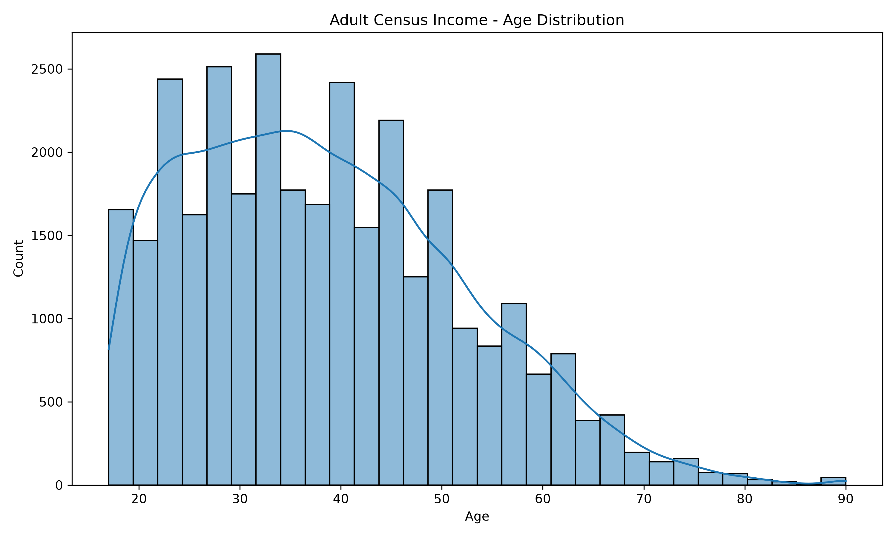

# Adult Census Income 분석 보고서

## 1. 프로젝트 개요

Adult Census Income 데이터를 Pandas와 Polars로 불러와 전처리하고,
소득 그룹에 따른 주당 근무시간 차이를 시각화·통계적으로 분석하였다.

이후 수치형 및 범주형 변수로 RandomForest Pipeline을 학습하여
개인의 소득 그룹이 `<=50K`인지 `>50K`인지 예측하였다.

## 2. Pandas·Polars 로딩 비교

동일한 로컬 원본 파일을 대상으로 Pandas와 Polars를 각각
`5`세트 × `3`회 실행하였다.

다운로드 시간은 제외하고 파일을 DataFrame으로 불러오는 시간만 측정하였다.

| 비교 항목 | Pandas | Polars |
|---|---:|---:|
| 데이터 크기 | `(32561, 15)` | `(32561, 15)` |
| 평균 로딩 시간 | `0.048715초` | `0.017517초` |
| 최소 로딩 시간 | `0.047167초` | `0.014307초` |
| 메모리 사용량 | `6.20MB` | `3.95MB` |

### 로딩 결과 검증

- shape 일치 여부: `True`
- 컬럼 이름 및 순서 일치 여부: `True`
- dtype 일치: `15/15`
- 모든 dtype 일치 여부: `True`

이번 실행 환경에서는 Polars의 평균 로딩 시간이 Pandas의 35.96% 수준으로 측정되었다. Polars의 메모리 사용량은 Pandas의 63.73% 수준으로 측정되었다. 실행 시간은 컴퓨터 상태와 실행 시점에 따라 달라질 수 있으므로, 이번 실행 환경에서 측정된 결과로 해석해야 한다.

Pandas와 Polars는 같은 의미의 자료형을 서로 다른 이름으로 표현할 수 있다.

예를 들어 Pandas의 `int64`와 Polars의 `Int64`,
Pandas의 문자열 자료형과 Polars의 `String`을 공통 범주로 변환하여 비교하였다.

## 3. 데이터 전처리 결과

- 처리 전 크기: `(32561, 15)`
- 처리 후 크기: `(32537, 15)`
- 제거한 중복 행: `24`
- 처리 후 중복 행: `0`
- 처리 후 결측치 총합: `0`

범주형 결측치는 데이터 손실을 줄이기 위해 `Unknown`으로 대체하고,
완전히 동일한 중복 행은 제거하였다.

## 4. 소득 그룹 분포

```text
income
<=50K    24698
>50K      7839
```

저소득 그룹은 전체의 75.91%, 고소득 그룹은 24.09%를 차지한다. 두 클래스의 비율 차이가 크므로 클래스 불균형이 존재한다.

## 5. 수치형 변수 기술통계

```text
              age        fnlwgt  education-num  capital-gain  capital-loss  hours-per-week
count  32537.0000  3.253700e+04     32537.0000    32537.0000    32537.0000      32537.0000
mean      38.5855  1.897808e+05        10.0818     1078.4437       87.3682         40.4403
std       13.6380  1.055565e+05         2.5716     7387.9574      403.1018         12.3469
min       17.0000  1.228500e+04         1.0000        0.0000        0.0000          1.0000
25%       28.0000  1.178270e+05         9.0000        0.0000        0.0000         40.0000
50%       37.0000  1.783560e+05        10.0000        0.0000        0.0000         40.0000
75%       48.0000  2.369930e+05        12.0000        0.0000        0.0000         45.0000
max       90.0000  1.484705e+06        16.0000    99999.0000     4356.0000         99.0000
```

기술통계에는 수치형 변수의 평균, 표준편차, 최솟값, 최댓값 및
25%, 50%, 75% 분위수가 포함된다.

## 6. 수치형 변수 상관계수

```text
                   age  fnlwgt  education-num  capital-gain  capital-loss  hours-per-week
age             1.0000 -0.0764         0.0362        0.0777        0.0577          0.0685
fnlwgt         -0.0764  1.0000        -0.0434        0.0004       -0.0103         -0.0189
education-num   0.0362 -0.0434         1.0000        0.1227        0.0799          0.1484
capital-gain    0.0777  0.0004         0.1227        1.0000       -0.0316          0.0784
capital-loss    0.0577 -0.0103         0.0799       -0.0316        1.0000          0.0542
hours-per-week  0.0685 -0.0189         0.1484        0.0784        0.0542          1.0000
```

자기상관을 제외했을 때 절댓값이 가장 큰 상관관계는 `education-num`과 `hours-per-week` 사이에서 나타났다. 상관계수는 0.1484로, 약한 양의 상관관계이다. 상관관계는 변수 간 연관성을 나타내지만 인과관계를 의미하지는 않는다.

## 7. 소득 그룹과 수치형 변수의 상관관계

문자열로 구성된 소득 그룹을 상관계수 계산을 위해 다음과 같이 변환하였다.

- `<=50K`: `0`
- `>50K`: `1`

```text
education-num     0.3353
age               0.2340
hours-per-week    0.2297
capital-gain      0.2233
capital-loss      0.1505
fnlwgt           -0.0095
```

수치형 변수 중 `education-num`이 소득 그룹과 가장 큰 상관관계를 보였다. 상관계수는 0.3353로, 보통 수준의 양의 상관관계이다. 반면 `fnlwgt`은 소득 그룹과의 선형 관계가 거의 나타나지 않았다. 이 결과는 변수와 소득 그룹 사이의 연관성을 나타내며, 해당 변수가 소득의 직접적인 원인이라는 의미는 아니다.

양의 상관계수는 해당 수치형 변수의 값이 높을수록
`>50K` 그룹과 연결되는 경향이 있음을 의미한다.

이 결과는 각 수치형 변수와 소득 그룹 사이의 선형 관계를 나타내며,
변수가 소득의 직접적인 원인이라는 의미는 아니다.

## 8. 시각화 결과

### 나이 분포



Seaborn 히스토그램과 밀도 곡선을 통해
Adult 데이터의 전체 나이 분포를 확인하였다.

### 소득 그룹별 주당 근무시간

[Plotly 인터랙티브 박스플롯 열기](figures/income_hours_boxplot.html)

고소득 그룹의 평균 주당 근무시간이 저소득 그룹보다 6.63시간 높았다. t-test 결과 이 평균 차이는 통계적으로 유의했다.

## 9. 소득 그룹별 주당 근무시간 t-test 및 효과 크기

- 저소득 그룹 표본 수: `24698`
- 고소득 그룹 표본 수: `7839`
- 저소득 그룹 평균 근무시간: `38.84`
- 고소득 그룹 평균 근무시간: `45.47`
- 평균 차이: `6.63`
- 저소득 그룹 표준편차: `12.3183`
- 고소득 그룹 표준편차: `11.0142`
- 통합 표준편차: `12.0171`
- Cohen's d: `0.5518`
- 효과 크기: `중간 정도의 효과`
- t-statistic: `-45.0950`
- p-value: `< 1e-300`
- 유의수준: `0.05`

### 가설

- 귀무가설: 두 소득 그룹의 평균 주당 근무시간에는 차이가 없다.
- 대립가설: 두 소득 그룹의 평균 주당 근무시간에는 차이가 있다.

p-value가 0.05보다 작으므로 귀무가설을 기각한다. 두 소득 그룹의 평균 주당 근무시간에는 통계적으로 유의한 차이가 있다.

Cohen's d는 0.5518로, 두 소득 그룹의 평균 근무시간 차이는 중간 정도의 효과로 해석된다.

## 10. RandomForest 모델 평가

- 학습 데이터 수: `26029`
- 테스트 데이터 수: `6508`
- Accuracy: `0.8574`
- Precision: `0.7346`
- Recall: `0.6390`
- F1-score: `0.6835`

### 다수 클래스 베이스라인 비교

다수 클래스 베이스라인은 학습 데이터에서 가장 많은 클래스로
모든 테스트 데이터를 예측하는 단순 기준 모델이다.

| 평가 지표 | 다수 클래스 베이스라인 | RandomForest |
|---|---:|---:|
| Accuracy | `0.7591` | `0.8574` |
| Precision | `0.0000` | `0.7346` |
| Recall | `0.0000` | `0.6390` |
| F1-score | `0.0000` | `0.6835` |

- 베이스라인 예측 클래스: `<=50K`
- RandomForest Accuracy 개선폭: `0.0983`
- 퍼센트포인트 기준 개선폭: `9.83%p`

다수 클래스 베이스라인의 Accuracy는 0.7591이고, RandomForest의 Accuracy는 0.8574이다. RandomForest의 Accuracy는 베이스라인보다 9.83%p 높았다. 베이스라인은 모든 데이터를 다수 클래스인 `<=50K`로 예측했기 때문에 고소득 그룹을 한 명도 찾아내지 못했다.

### Confusion Matrix

```text
[[4578, 362], [566, 1002]]
```

### Classification Report

```text
              precision    recall  f1-score   support

       <=50K       0.89      0.93      0.91      4940
        >50K       0.73      0.64      0.68      1568

    accuracy                           0.86      6508
   macro avg       0.81      0.78      0.80      6508
weighted avg       0.85      0.86      0.85      6508

```

- 모델 저장 위치: `models/adult_income_pipeline.joblib`

모델의 전체 Accuracy는 0.8574, 고소득 그룹 F1-score는 0.6835이다. 고소득 그룹의 Recall이 Precision보다 낮으므로, 고소득으로 예측한 결과의 정확성보다 실제 고소득자를 놓치는 문제가 상대적으로 더 크게 나타났다.

## 11. 결론

수치형 변수 중 `education-num`이 소득 그룹과 가장 큰 상관관계를 보였다. 상관계수는 0.3353로, 보통 수준의 양의 상관관계이다. 반면 `fnlwgt`은 소득 그룹과의 선형 관계가 거의 나타나지 않았다. 이 결과는 변수와 소득 그룹 사이의 연관성을 나타내며, 해당 변수가 소득의 직접적인 원인이라는 의미는 아니다.

고소득 그룹의 평균 주당 근무시간이 저소득 그룹보다 6.63시간 높았다. t-test 결과 이 평균 차이는 통계적으로 유의했다.

Cohen's d는 0.5518로, 두 소득 그룹의 평균 근무시간 차이는 중간 정도의 효과로 해석된다.

모델의 전체 Accuracy는 0.8574, 고소득 그룹 F1-score는 0.6835이다. 고소득 그룹의 Recall이 Precision보다 낮으므로, 고소득으로 예측한 결과의 정확성보다 실제 고소득자를 놓치는 문제가 상대적으로 더 크게 나타났다.

다수 클래스 베이스라인의 Accuracy는 0.7591이고, RandomForest의 Accuracy는 0.8574이다. RandomForest의 Accuracy는 베이스라인보다 9.83%p 높았다. 베이스라인은 모든 데이터를 다수 클래스인 `<=50K`로 예측했기 때문에 고소득 그룹을 한 명도 찾아내지 못했다.

## 12. 한계 및 개선 방향

- 소득 클래스 비율이 다르므로 Accuracy만으로 모델을 평가하기 어렵다.
- 고소득 그룹의 Recall과 F1-score를 함께 확인해야 한다.
- RandomForest 하이퍼파라미터 튜닝을 통해 성능을 개선할 수 있다.
- Logistic Regression 등 다른 분류 모델과 성능을 비교할 수 있다.
- 통계적으로 유의한 차이가 실제로도 중요한 차이인지 효과 크기를 추가로 분석할 수 있다.
